<!-- ============================================================
     ABOVE THE GRAY FOG · full ritual edition
     LOTM themed GitHub profile · Awadul
     Requires in repo root: fog-banner.svg, mystic-torus.svg, mystic-divider.svg
     Palette: void #0a0a0f · fog #71717a · crimson #b91c1c · mist #d4d4d8 · spirit gold #c9a227
     ============================================================ -->

<!-- ACT I · The fog rolls in (animated: drifting fog, pulsing moon, twinkling stars) -->

<!-- The whisper above the fog -->

 

## 🃏 The Record Keeper's Notes

> *Somewhere above the gray fog sits a developer at a long bronze table, reading pull requests instead of prayers.*

I'm **Awais**, a Computer Science student at NUST Islamabad and a freelance full stack developer. I build web apps end to end with a JavaScript only stack, no borrowed powers from other pathways. Current fixation: shipping real products, not just repos.

- 🔮 **Divining:** a CV customizer platform with AI powered parsing and live preview
- ⚗️ **Brewing potions with:** React, Next.js, Node.js, PostgreSQL, and the OpenAI API
- 📜 **Acting method:** you don't master a stack by reading about it, you become it by building with it
- 🕯️ **Reach across the fog:** [awadul.github.io](https://awadul.github.io) · awaisabdullahm79@gmail.com

## 🪐 The Orrery Above the Fog

*A tri-ring torus turning around the crimson moon. The vertical ring tumbles through the third dimension; two spirit motes ride the bands in opposite directions; the outer zodiac dial completes one revolution per minute.*

## 🜏 Sequence Ladder of the Pathway

*A Beyonder does not skip sequences. Digest the potion before you drink the next.*

| Sequence | Name | Powers Acquired | State |
|:--------:|:-----|:----------------|:-----:|
| **9** | Apprentice | HTML, CSS, vanilla JavaScript | ✅ Digested |
| **8** | Reader | React, Tailwind CSS, component thinking | ✅ Digested |
| **7** | Animator | Next.js, Framer Motion, polished UI | ✅ Digested |
| **6** | Artisan | Node.js, Express, REST APIs | ✅ Digested |
| **5** | Keeper of Records | PostgreSQL, MongoDB, Supabase | ✅ Digested |
| **4** | Ritual Master | OpenAI API, RAG systems, AI integration | 🌀 Digesting |
| **3** | Architect | System design at scale | 🔒 Sealed |
| **2** | ??? | *The characteristics have not yet converged* | 🔒 Sealed |
| **1** | ??? | *Lost to the fog* | 🔒 Sealed |
| **0** | The Shipper | *He who deploys on Friday and does not fear* | 🌫️ Myth |

## 🎴 The Gathering at the Bronze Table

*Every Monday above the fog, the seats fill. Each seat is a hat I wear on a real project.*

| Seat | Domain | Where it manifests |
|:----:|:-------|:-------------------|
| 🌑 **The Hermit** | Deep focus, solo builds | Freelance client work since 2025 |
| ⚖️ **Justice** | Honest READMEs, no inflated claims | Every repo on this profile |
| 🌙 **The Moon** | Late night debugging rituals | PostgreSQL migrations at 2 AM |
| ☀️ **The Sun** | UI polish, motion, first impressions | Framer Motion, Tailwind design systems |
| 🐍 **The Hanged Man** | Inverting the problem until it confesses | RAG retrieval tuning |
| 🌟 **The Star** | The product that must ship | CV Customizer platform |

## 🌒 Artifacts Recovered From the Fog

*Each artifact carries a curse: maintenance.*

<table>
<tr>
<td width="50%">

### 🎴 The Card of Blasphemy: CV Customizer
AI powered resume platform. GPT-4o parallel extraction into structured JSON, React frontend with live preview and PDF export. A ritual that turns messy documents into clean, ATS friendly records.

`Node.js` `Express` `GPT-4o` `React` `Vite`

</td>
<td width="50%">

### 📖 The Forbidden Tome: NUST Policy RAG Bot
A question answering system over policy documents. Hybrid retrieval with TF-IDF, MinHash LSH, and SimHash, returning exact page numbers and matched passages. Divination, but reproducible.

`RAG` `TF-IDF` `MinHash LSH` `SimHash` — [open the tome](https://github.com/Awadul/NUST-Policy-Document-RAG-System)

</td>
</tr>
<tr>
<td width="50%">

### 🕸️ The Marionette Network: SwiftBite
Food delivery monorepo. Four Next.js portals, an Express and Prisma backend, Socket.io real time GPS tracking, PostgreSQL and Redis. Many puppets, one set of strings.

`Turborepo` `Next.js 14` `Socket.io` `Prisma` `Redis`

</td>
<td width="50%">

### 🎨 The Illusionist's Canvas: Pixal Craft
A frontend playground where motion and interface design get pushed past sensible limits. Built to practice the craft, kept because it turned out well.

`React` `Framer Motion` `Tailwind` — [peer inside](https://pixal-craft.vercel.app)

</td>
</tr>
</table>

## ⚗️ Ingredients of the Potion

  

<!-- animated flavor line under the icons -->

## 🔮 Scrying Mirror

*Spirit vision reveals the truth of a developer: not their words, their commit graph.*

  

  

<!-- The contribution graph, read like tarot -->

## 🐍 The Serpent of Mercury

<picture>
  <source media="(prefers-color-scheme: dark)" srcset="https://raw.githubusercontent.com/Awadul/Awadul/output/github-contribution-grid-snake-dark.svg"/>
  
</picture>

*It devours green squares the way deadlines devour weekends.*

 

<!-- ACT V · The crimson moon sets -->

🕯️ *This profile loses control on the nights of a full crimson moon. Please refresh.*

